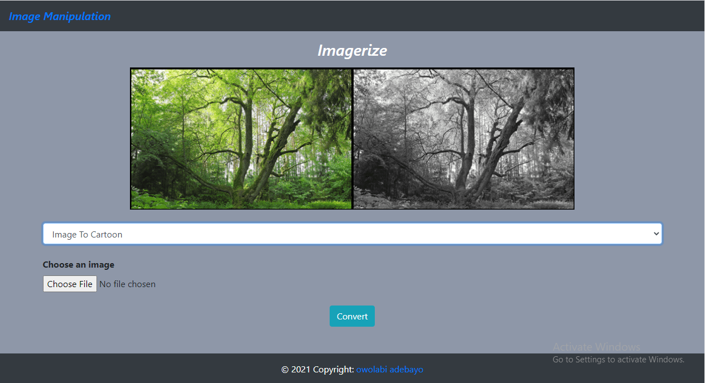

# Manipulation Of Image Using Python like OpenCv

_OpenCV provides a real-time optimized Computer Vision library, tools, and hardware. It also supports model execution for Machine Learning (ML)_

## A good python app used for image manipulation and processing

